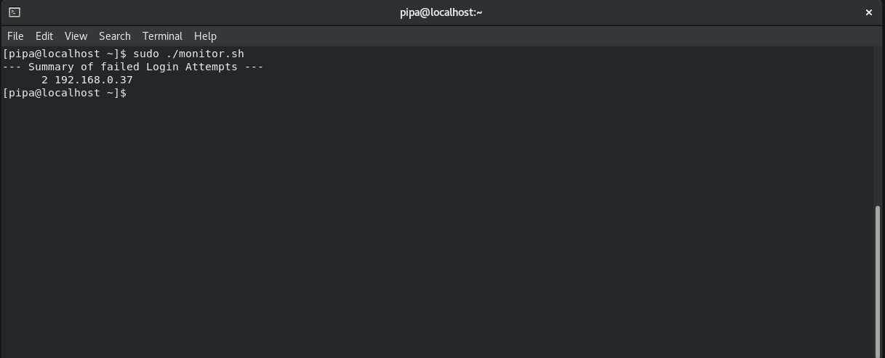

# Home_Lab_Infrastructure
# Enterprise Home Lab - IT & Cybersecurity
🚀 Overview
This project showcases a fully functional corporate network environment simulated using Virtual Machines. It focuses on infrastructure administration, security auditing, and automation.

## 🛠 Tech Stack
* **Windows Server 2022**: Domain Controller (AD DS), DNS, and Group Policy Management.
* **Rocky Linux**: Integrated server for monitoring and security log analysis.
* **Windows 10 Pro**: Client machine for testing GPOs and user permissions.

### 📁 Key Features
* **Active Directory Management**: Structured OUs, Groups, and User Lifecycle.
* **Automation**: PowerShell and Bash scripts for routine health checks and security auditing.
* **Security Hardening**: Implementation of GPOs and monitoring of failed login attempts.

### 🎓 Education
* **Cybersecurity Student** - Universidad Nacional de Scalabrini Ortiz (UNSO).
* **Server Administration Course** - UTN.

## Proof of Work (Screenshots)

### 1. Active Directory Audit
Testing the PowerShell script to detect inactive users in the Windows Server 2022 domain.

### 2. Linux Authentication Monitor
Validating the Bash script in Rocky Linux by simulating failed login attempts via SSH.

### 3. Infrastructure Health Check
Running the health check on critical services (DNS, ADWS, NTDS) and gateway connectivity.

